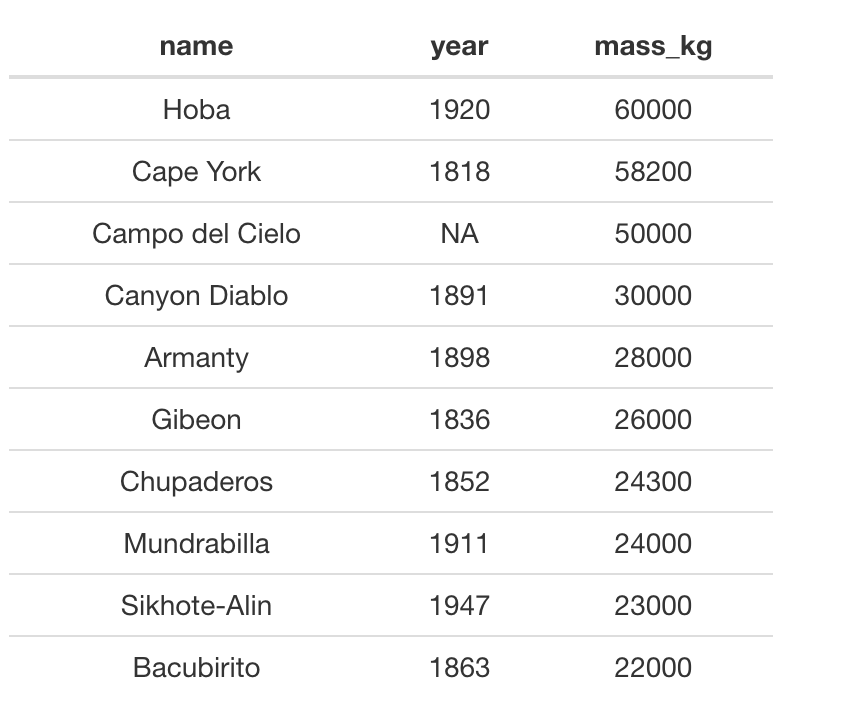
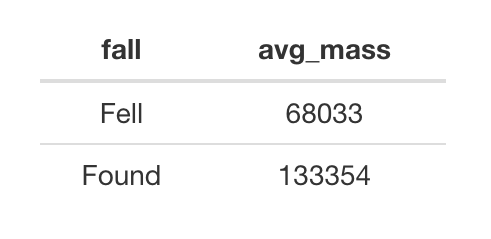
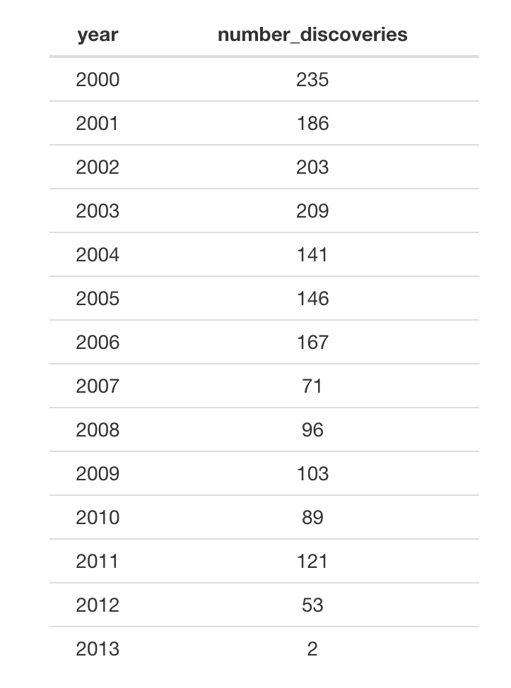
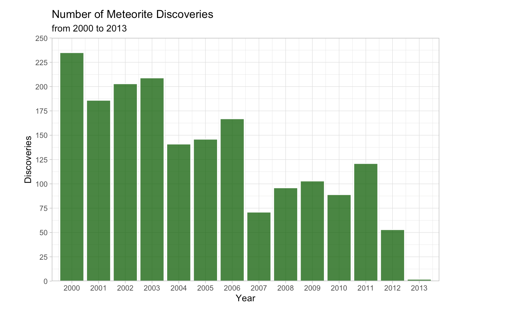

## Meteorite Analysis

#### 1. Read the cleaned data into R.

```

library(tidyverse)
library(rmarkdown)
library(pander)
library(latexpdf)

meteorite_clean <- read_csv("/Users/Natifu/github_projects/meteorite_analysis/clean_data/meteorite_clean")

```


#### 2. Find the names and years found for the 10 largest meteorites in the data.

```
meteorite_clean %>% 
  slice_max(mass, n = 10) %>% 
  mutate(mass_kg = mass/1000) %>% 
  select(name, year, mass_kg) %>% 
  pander()

```



#### 3. Find the average mass of meteorites that were recorded falling, vs. those which were just found.

```
meteorite_clean %>% 
  group_by(fall) %>% 
  summarise(avg_mass = mean(mass)) %>% 
  pander()

```



#### 4. Find the number of meteorites in each year, for every year since 2000.

```

meteorite_clean %>% 
  filter(year >= 2000) %>% 
  group_by(year) %>% 
  summarise(number_discoveries = n()) %>% 
  pander()

```



#### 5. Visualise results

```{r, warning=FALSE, message=FALSE}

meteorite_clean %>% 
  filter(year >= 2000) %>% 
  group_by(year) %>% 
  summarise(number_discoveries = n()) %>% 
  ggplot(aes(x = year, y = number_discoveries)) +
  geom_col(alpha = 0.8, colour = "white", fill = "dark green") +
  scale_x_continuous(breaks = c(2000, 2001, 2002, 2003, 2004,
                                2005, 2006, 2007, 2008, 2009,
                                2010, 2011, 2012, 2013),
                     expand = c(0.02, 0.02)) +
  scale_y_continuous(breaks = c(0, 25, 50, 75, 100, 125, 150, 175, 200, 225, 250),
                     limits = c(0, 250),
                     expand = c(0, 0)) +
  labs(title = "Number of Meteorite Discoveries", subtitle = "from 2000 to 2013",
       x = "Year", y = "Discoveries") +
  theme_light()

```




